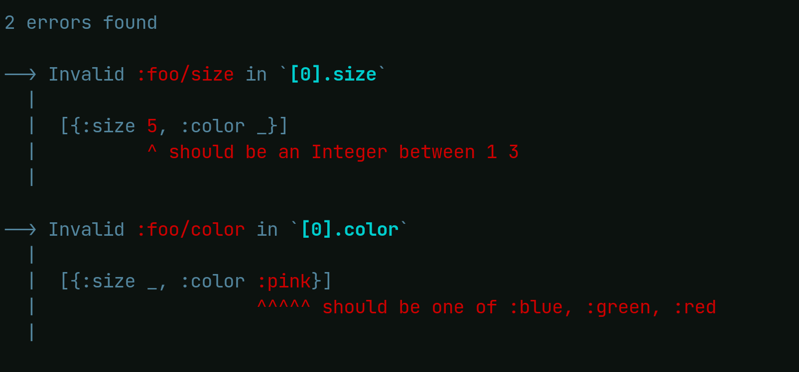

# lingo

> The language and speech, especially the jargon, slang, or argot, of
> a particular field, group, or individual

Trying to make spec explain message more usable with small, composable additions.

The goal is to provide the spec users with more data from errors and means to
render helpful error messages.

It differs from other similar libraries in that the focus is more on
explain-data enrichment first, then leveraging this for potential rendering.

In some cases it's better to leave the `problems` as a specialized collection
items and be very detailed per problem, in others you prefer to group things to
show more compact errors (typically like showing a set of missing keys in a
map).

## Documentation

Adds 3 functions similar to clojure.spec.alpha/explain-*

* `exoscale.lingo/explain-data`: returns
  clojure.spec.alpha/explain-data for spec/value with extra fields

* `exoscale.lingo/explain`: uses exoscale.lingo/explain-data but prints
  a nicely formated message)

* `exoscale.lingo/explain-str`: same as exoscale.lingo/explain but
  returns a string instead of printing

`exoscale.lingo/explain-data` is the most important one really

It will take a spec, a value and potentially options and return clojure.spec
explain-data for it with extra fields added.

Some very high level:

* `:exoscale.lingo.explain/message` infered error message you might want to display
* `:exoscale.lingo.explain/path` humanized path
* `:exoscale.lingo.explain/highlight` potential highlight output (shows error
  value in context with blanked suroundings)

Keys related to a potential custom error message found at spec level:

* `:exoscale.lingo.explain.spec/spec` which spec had a message registered for it
* `:exoscale.lingo.explain.spec/message` the message in question

Keys related to a potential error infered from pred data
* `:exoscale.lingo.explain.pred/spec` the spec used to match the predicate (via conform)
* `:exoscale.lingo.explain.pred/vals` the values destructured via conformed
* `:exoscale.lingo.explain.pred/message` the message generated from the values extracted + potential formater registered for this predicate key

So that's quite a lot of information, in most cases you will just care about the
first three, but the rest is available to you via explain-data if you need/want
to build your own outputs. If you look at the way `lingo/explain-data` is
implemented you will also see that all this is very composable you can easily
enrich/lighten this information.

Ok, now examples:

First out of the box, without any custom message added to a spec:

```clj
(s/def :foo/t-shirts (s/coll-of :foo/t-shirt))
(s/def :foo/t-shirt (s/keys :req-un [:foo/size :foo/color]))
(s/def :foo/size (s/int-in 1 3))
(s/def :foo/color #{:red :blue :green})

(exoscale.lingo/explain :foo/t-shirts [{:size 5 :color :pink}])
```


Let's see how it's done under the hood
```clj
(exoscale.lingo/explain-data :foo/t-shirts [{:size 5 :color :pink}])

#:clojure.spec.alpha{:problems
                     ({:path [:size],
                       :exoscale.lingo.explain.pred/spec
                       :exoscale.lingo.pred/int-in-range,
                       :pred
                       (clojure.core/fn
                        [%]
                        (clojure.spec.alpha/int-in-range? 1 3 %)),
                       :exoscale.lingo.explain/highlight
                       "[{:size 5, :color _}]\n        ^ should be an Integer between 1 3",
                       :via [:foo/t-shirts :foo/t-shirt :foo/size],
                       :val 5,
                       :exoscale.lingo.explain.pred/message
                       "should be an Integer between 1 3",
                       :exoscale.lingo.explain/message
                       "should be an Integer between 1 3",
                       :exoscale.lingo.explain.pred/vals
                       [:_ {:_ %, :min 1, :max 3}],
                       :exoscale.lingo.explain/path "[0].size",
                       :in [0 :size]}
                      {:path [:color],
                       :exoscale.lingo.explain.pred/spec
                       :exoscale.lingo.pred/set,
                       :pred #{:green :red :blue},
                       :exoscale.lingo.explain/highlight
                       "[{:size _, :color :pink}]\n                  ^^^^^ should be one of :blue, :green, :red",
                       :via [:foo/t-shirts :foo/t-shirt :foo/color],
                       :val :pink,
                       :exoscale.lingo.explain.pred/message
                       "should be one of :blue, :green, :red",
                       :exoscale.lingo.explain/message
                       "should be one of :blue, :green, :red",
                       :exoscale.lingo.explain.pred/vals #{:green :red :blue},
                       :exoscale.lingo.explain/path "[0].color",
                       :in [0 :color]}),
                     :spec :foo/t-shirts,
                     :value [{:size 5, :color :pink}]}

```

As you can see there's a lot of more information available than what spec
returns alone.  There seem to be repetitions in the data, but that will make
more sense after it's explained.

There are 2 ways to specify custom messages, depending on what is the source you
start from:

If you are working from spec identifiers or static forms you can use
`set-spec-error!`, it will dispatch on the problem spec (value we get from
explain-data `:via`), potentially resolving aliases too, up to the pred failing
at the end. spec errors will result in addition of
`:exoscale.lingo.explain.spec/*` keys to the problem data.

``` clj
(set-spec-error! `string? "should be a String")
(set-spec-error! ::thing "should be a Thing")
(set-spec-error! (s/coll-of ::thing) "should be a collection of Things")
```

What I meant by "resolving aliases" is that for something like this

``` clj
(s/def ::foo ::bar)
(s/def ::bar ::baz)
```

If you have a custom message on ::baz or ::bar and your value blows up
at ::foo level, lingo will pick up the first message in the alias
chain (so checks ::foo, then ::bar and then ::baz). Alias information
is not data available from raw explain-data, lingo has to infer by itself.


If you want to have more precise error handling based on the problem pred only
(usually it's the best things to do) you can use `set-pred-error!`. This will
result in the addition of the `:exoscale.lingo.explain.pred/*` keys to the
problem.

``` clj
(set-pred-error! (s/def ::int-in-range (s/cat :_ #{'clojure.spec.alpha/int-in-range?}
                        :min number?
                        :max number?
                        :_ #{'%}))
                 (fn [{:keys [min max]} _opts]
                   (format "should be an Integer between %d %d" min max)))
```

This will use the first argument to perform conforming against the
pred in the explain-data problems and use the bound values with second
argument, a function to generate a precise message.

Internally these are really 2 distinct operations, we first destructure via the
spec then render in another step.

so for an error like this:

```clj
#:clojure.spec.alpha{:problems
                     [{:path [],
                       :pred
                       (clojure.core/fn
                        [%]
                        (clojure.spec.alpha/int-in-range? 0 3 %)),
                       :val 4,
                       :via [],
                       :in []}],
                     :spec
                     #object[clojure.spec.alpha$and_spec_impl$reify__blabla]
                     :value 4}
```


It will pass the abbreviated `(clojure.spec.alpha/int-in-range? 0 3
%)` to the conforming spec we defined.

``` clj
(s/cat :_ #{'clojure.spec.alpha/int-in-range?}
                        :min number?
                        :max number?
                        :_ #{'%})
```

Which will destructure it to `{:min 0 :max 3}` and call the following
function on it.

``` clj
(fn [{:keys [min max]} _opts]
   (format "should be an Integer between %d %d" min max))
```

This is a trivial example, but if you take a s/coll-of (or any of
s/every variants), which can return a miriad of `preds` depending on
how failure happened, this will return very fine grained error message
that pin-point exactly how the value failed.
This is also very handy for more "custom" other uses cases, such as
`exoscale.specs/string-of` and other paramerized specs we might have.

By default a lot of common predicates are supported out of the box ,
most math comparaison operators and compositions of these with `count`
for instance, Set/Map membership (or lack thereof), and most of
clojure.spec custom predicates.


`set-pred-error!` calls internally `set-pred-conformer!` and
`set-pred-message!`, the operations are decoupled. If you only care about the
destructuring just set a pred conformer for your use and leave the formater out.

You can in theory have a custom error message at both spec level and pred level
and mix them to create something very detailed, but by default lingo sets
:exoscale.lingo.explain/message to the value that makes more sense for you (all
the rest is still available in the explain-data), it will try to get something from the spec explain we generate first, and fallback to the pred message.

The tests demonstrate some of these :
https://github.com/exoscale/lingo/blob/master/test/exoscale/lingo/test/core_test.cljc

### Options

* `:registry` defaults to lingo's internal registry, but you can have your own, could be handy if you need to support multiple languages for instance
* `:conform` defaults to `(memoize s/conform)` the function used to destructure predicate forms
* `:highlight?` defaults to true, whether we should try to provide an highlight of the error value
* `:highlight-inline-message?` defaults to false, whether we should show the explain message inline with the error marker in the highlight
* `:highlight-colors?` defaults to false, whether to use terminal colors with the highlight

### replacing clojure spec printer

You can use `(exoscale.lingo/set-explain-printer! ?opts)` to set a default printer for spec.

```clj
(lingo/set-explain-printer!)

(s/explain string? 1)

;; 1 is invalid - should be a String

(s/assert string? 1)

```

## License

Copyright © 2022 [Exoscale](https://exoscale.com)
